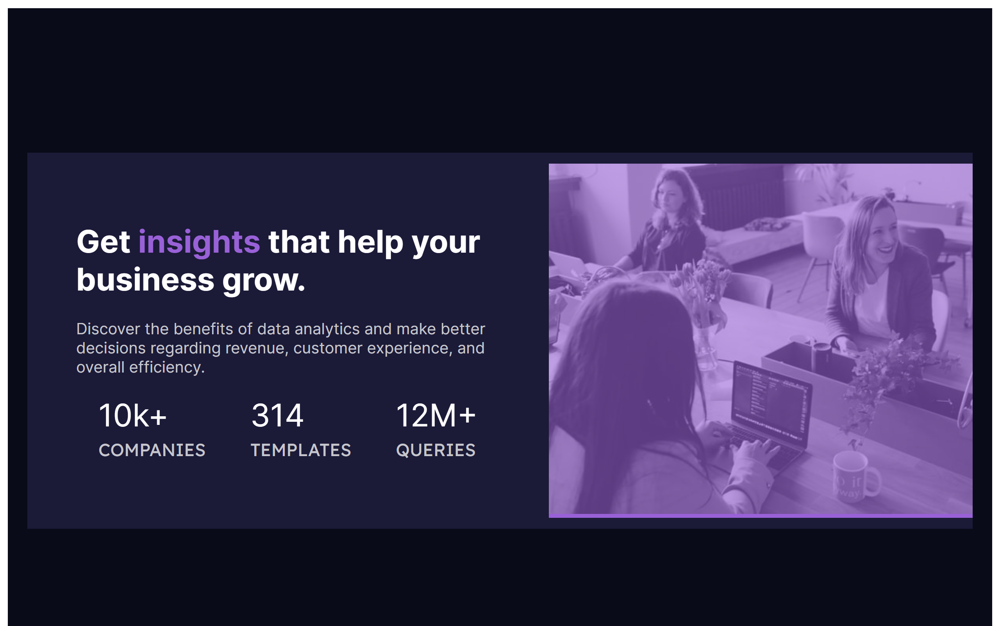
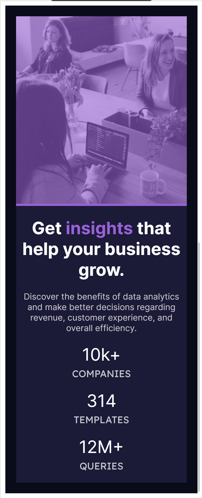

# Frontend Mentor - Stats preview card component solution

This is a solution to the [Stats preview card component challenge on Frontend Mentor](https://www.frontendmentor.io/challenges/stats-preview-card-component-8JqbgoU62). Frontend Mentor challenges help you improve your coding skills by building realistic projects. 

## Table of contents

- [Overview](#overview)
  - [The challenge](#the-challenge)
  - [Screenshot](#screenshot)
  - [Links](#links)
- [My process](#my-process)
  - [Built with](#built-with)
  - [What I learned](#what-i-learned)
  - [Continued development](#continued-development)
  - [Useful resources](#useful-resources)
- [Author](#author)

## Overview

### The challenge

Users should be able to:

- View the optimal layout depending on their device's screen size

### Screenshot




### Links

- Solution URL: [Github Code](https://github.com/Ruandv/card-component)
- Live Site URL: [Live site (Github Pages)](https://ruandv.github.io/card-component/)

## My process

### Built with

- Flexbox
- [React](https://reactjs.org/) - JS library
- [Syntactically Awesome Style Sheets](https://sass-lang.com/) - For styles

### What I learned

During the design of this card component I learned how to use css flexbox and how to use the reverse settings to swop things around if you want to use it during different screen sizes using Media Queries.

```css
@media only screen and (max-device-width: 768px) {
  .container {
    flex-direction: column-reverse;
  }
}
```

### Continued development

Use this section to outline areas that you want to continue focusing on in future projects. These could be concepts you're still not completely comfortable with or techniques you found useful that you want to refine and perfect.

**Note: Delete this note and the content within this section and replace with your own plans for continued development.**

### Useful resources

- [css-tricks.com](https://css-tricks.com/snippets/css/a-guide-to-flexbox/) - This helped me for quick reference on how to use the Flexbox styles.

## Author

- Website - [Ruan de Villiers](https://ruandv.github.io/)
- Frontend Mentor - [@Ruandv](https://www.frontendmentor.io/profile/Ruandv)